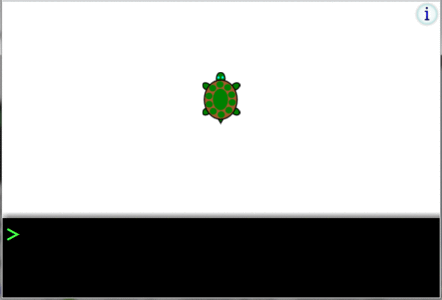

# 用python作画（1）：玫瑰花

情人节到了，作为一个码农，你想给自己的女朋友一个浪漫的情人节，但是又想不失身份怎么办？用你的代码来为她画出美丽的花是一个不二的选择。

那么，如何使用python来画一朵美丽的鲜花呢？


## Turtle 包

python 程序员们最幸福的事情就是几乎永远可以站在巨人的肩膀上，今天我们将要介绍的肩膀就是turtle packge.

相信不少程序员们一开始可能都玩过让海龟在屏幕中移动，然后画出五角星的小游戏：



turtle包所做的事情和这个是一模一样的，那么就让我们来介绍一下turtle这个package中最基本的一些函数吧：

```python
import turtle as t
#将包导入


t.penup()
t.pendown()
'''
这两个函数在这里是用于提起与放下画笔，提起画笔后海龟不会在屏幕上
留下痕迹，而放下画笔后的海龟任意的移动都会在路径上留下痕迹。
'''

t.setup()
t.done()
#这两个函数将会展开一个画布，或者结束作画

t.pencolor()
t.pensize()
t.fillcolor()
'''
定义了画笔颜色，画笔粗细和填充颜色
'''

t.goto()
#告诉turtle 现在该去哪里

t.circle()
#让turtle以指定的方式画圆弧

t.forward()
t.backward()
t.left()
t.right()
#让turtle 向指定方向移动
```

有了这些基础知识，我们就可以开始画玫瑰了。
## 玫瑰花作画


```python
# 首先我们需要一个一步一步画曲线的方程：
import turtle as t
# Define a curve drawing function
def DegreeCurve(n, r, d=1):
    for i in range(n):
        t.left(d)
        t.circle(r, abs(d))

# 之后我们画花蕾

s = 0.2 # size
t.setup(450*5*s, 750*5*s)
t.pencolor("black")
t.fillcolor("red")
t.speed(100)
t.penup()
t.goto(0, 900*s)
t.pendown()
 # 
t.begin_fill()
t.circle(200*s,30)
DegreeCurve(60, 50*s)
t.circle(200*s,30)
DegreeCurve(4, 100*s)
t.circle(200*s,50)
DegreeCurve(50, 50*s)
t.circle(350*s,65)
DegreeCurve(40, 70*s)
t.circle(150*s,50)
DegreeCurve(20, 50*s, -1)
t.circle(400*s,60)
DegreeCurve(18, 50*s)
t.fd(250*s)
t.right(150)
t.circle(-500*s,12)
t.left(140)
t.circle(550*s,110)
t.left(27)
t.circle(650*s,100)
t.left(130)
t.circle(-300*s,20)
t.right(123)
t.circle(220*s,57)
t.end_fill()
```


```python
#我们开始画花茎

t.pencolor("pink")
t.pensize(1)
t.left(120)
t.fd(280*s)
t.left(115)
t.circle(300*s,33)
t.left(180)
t.circle(-300*s,33)
DegreeCurve(70, 225*s, -1)
t.circle(350*s,104)
t.left(90)
t.circle(200*s,105)
t.circle(-500*s,63)
t.penup()
t.goto(170*s,-30*s)
t.pendown()
t.pencolor("green")
t.pensize(5)
t.left(160)
DegreeCurve(20, 2500*s)
DegreeCurve(220, 250*s, -1)
```


```python
#最后搞定叶子

t.pencolor("black")
t.pensize(1)
t.fillcolor('green')
t.penup()
t.goto(670*s,-180*s)
t.pendown()
t.right(140)
t.begin_fill()
t.circle(300*s,120)
t.left(60)
t.circle(300*s,120)
t.end_fill()
t.penup()
t.goto(180*s,-550*s)
t.pendown()
t.right(85)
t.circle(600*s,40)
 # Draw another green leaf
t.penup()
t.goto(-150*s,-1000*s)
t.pendown()
t.begin_fill()
t.rt(120)
t.circle(300*s,115)
t.left(75)
t.circle(300*s,100)
t.end_fill()
t.penup()
t.goto(430*s,-1070*s)
t.pendown()
t.right(30)
t.circle(-600*s,35)
t.done()
```


怎么样？是不是非常简单？快去为你心仪的女生画一朵吧！

当然了，这支玫瑰是我们硬定义好的坐标来画的，那么有没有一种方法，
可以让我们随机的画好看的画呢？当然有啦，让我们期待之后的更新吧！

预告：


## 参考资料：

1. 本玫瑰花的坐标和画法并非原创，原作者请参考[Rose Drawing](http://www.programmersought.com/article/7647365234/)

2. 如果需要更多有关turtle的信息，请参照[turtle API](https://docs.python.org/2/library/turtle.html)
